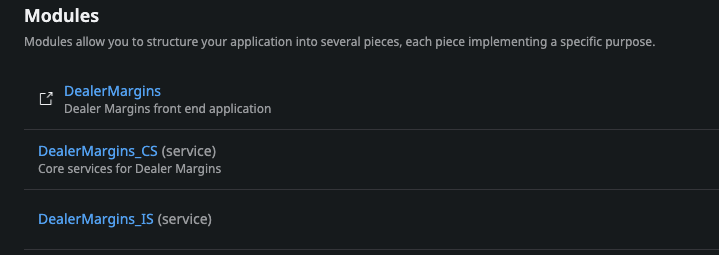

Application
===========

.. _application:

Modules
-------

#. DealerMargins
    The end-user component represents the individuals who interact with the OutSystems applications. End-users utilize the user interface (UI) provided by the applications to perform tasks, view information, and interact with the system.
#. DealerMargins_CS
    The core service component in OutSystems architecture includes the business logic and data management aspects of the applications. It encompasses the application's backend functionality, such as data processing, calculations, validations, and rules. The core service handles the execution of the application's logic, ensuring that data is processed correctly and business rules are enforced.
#. DealerMargins_IS
    The integration service component enables communication and data exchange between the OutSystems applications and external systems or services. It facilitates integrations with external databases, web services, APIs, or other software systems. The integration service allows the OutSystems applications to interact with and retrieve data from external sources, as well as send data to those systems for further processing or storage.

Interface
=========

**DealerMargins**

UI Flows
--------

* Common
    * Invalid Permission
    * Login
    * Consumer Credential (Block)
    * Menu (Block)
    * MenuIcon (Block)
    * UserInfo (Block)
* MainFlow
    * Award Calculation
    * Award Reports
    * Award Generate
    * Component
    * Component Assignment
    * Dealer
    * Dealer Assignment
    * Dealer Level Guarantee
    * Plan
    * Process
    * Region
    * Wholesale Transaction
    * Legacy VIN
    * Assign Component (Block)
    * Award Report (Block)
    * Component (Block)
    * Component Summary (Block)
    * Dealer Assignment (Block)
    * Dealer Summary (Block)
    * Error Log (Block)
    * VIN Summary (Block)
* Reports
    * Report Index
    * Report Template Upload
    * Entity Reset (Dev)
    * Dashboard Table (Block)
* TableView
    * Reference Master Upload (Dev & Admin)
    * Backend Tables
    * Table Component (Block)