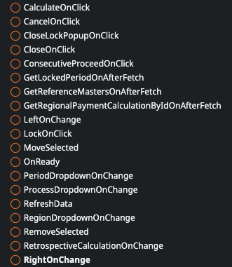
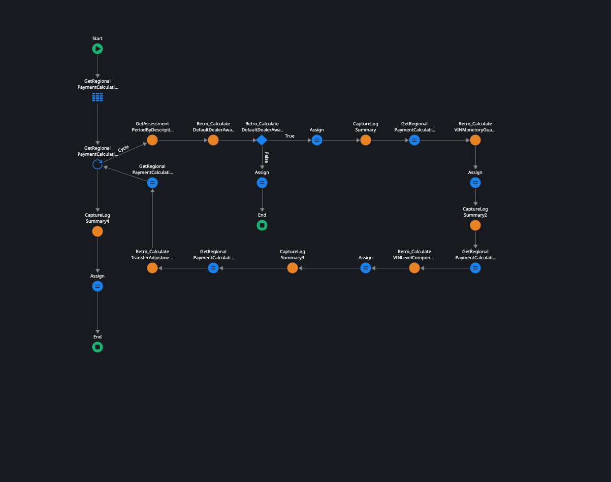

.. _award_calculation:

Award Calculation
=================

The award calculation for dealers involves a systematic process of evaluating their performance and determining the recipients of recognition and rewards. This process incorporates various metrics and criteria, such as sales growth, customer satisfaction ratings, marketing efforts, and adherence to company policies. The calculation takes into account quantitative and qualitative factors to ensure a fair and comprehensive assessment. By accurately calculating awards, companies can motivate dealers to strive for excellence, foster healthy competition, and drive business growth. The award calculation serves as a powerful tool for acknowledging the outstanding achievements of dealers and reinforcing their commitment to success.

Reference:
----------

Link: https://bml-dev.outsystemsenterprise.com/DealerMargins/AwardCalculation

Web View:

Screen Actions:

Variables:

Data Source:

Calculation Flow:
-----------------

#. The calculation is initiated by selecting the 'CalculateOnClick' screen action.

.. image:: images/Screens/Award_Calculation/CalculateOnClick.png
   :width: 600

* The preceding step invokes the "Initiate Calculation" action, which creates an initial entry in the **Regional Payment Calculation** entity for either Primary or Retro entries.
* Subsequently, the following actions are triggered:
    #. Validate Process (Initiate Process)
        * Consecutive Period Valdation
        * Plan Configuratio Validation
        * Wholesale Data Validation
    #. Process Primary Calculation (Process Calculation)
        * Default Dealer Component Award
        * VIN Level Guarantee (VIN Monetory)
        * VIN Level Component Awards (VIN Award By Component)
        * Dealer Transfers (Transfer Adjustment)
    #. Process Retro Calculation (if Any) (Process Retro Calculation)
        * Retro Default Dealer Component Award
        * Retro VIN Level Guarantee (VIN Monetory)
        * Retro VIN Level Component Awards (VIN Award By Component)
        * Retro Dealer Transfers (Transfer Adjustment)

Initiate Calculation
--------------------

Initiate Process
----------------

Consecutive Period Valdation
----------------------------

Plan Configuratio Validation
----------------------------

Wholesale Data Validation
-------------------------

Process Calculation
-------------------

Default Dealer Component Award
------------------------------

Component Level Award & VIN Component Level Award
-------------------------------------------------

VIN Level Guarantee (VIN Monetory)
----------------------------------

VIN Level Component Awards (VIN Award By Component)
---------------------------------------------------

Dealer Transfers (Transfer Adjustment)
--------------------------------------

Retor Process Calculation
-------------------------

Retro Default Dealer Component Award
------------------------------------

Retro VIN Level Guarantee (VIN Monetory)
----------------------------------------

Retro VIN Level Component Awards (VIN Award By Component)
---------------------------------------------------------

.. image:: images/Screens/Award_Calculation/Retro_CalculateVINLevelComponentAward.png
    :width: 600

Retro Dealer Transfers (Transfer Adjustment)
--------------------------------------------

.. image:: images/Screens/Award_Calculation/Retro_CalculateTransferAdjustment.png
    :width: 600

